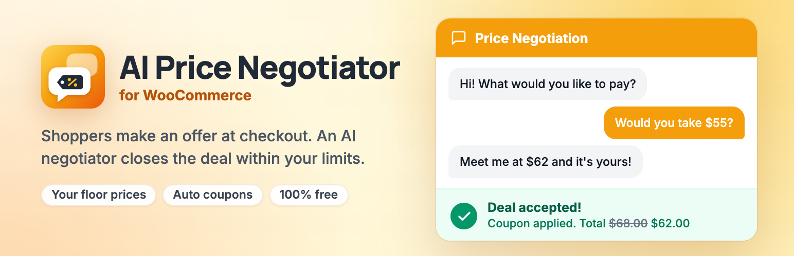

# AI Price Negotiator for WooCommerce

[](https://wordpress.org/plugins/ai-price-negotiator-for-woocommerce/)
[](https://wordpress.org/plugins/ai-price-negotiator-for-woocommerce/)
[](https://wordpress.org/plugins/ai-price-negotiator-for-woocommerce/)
[](https://github.com/wpankit/ai-price-negotiator-for-woocommerce/actions/workflows/coding-standards.yml)
[](https://github.com/wpankit/ai-price-negotiator-for-woocommerce/actions/workflows/plugin-check.yml)
[](LICENSE)



Let shoppers make an offer on their cart at checkout. An AI negotiator counters within your price limits, and when both sides agree, the plugin applies the deal as a one-time coupon.

**[Get it on WordPress.org](https://wordpress.org/plugins/ai-price-negotiator-for-woocommerce/)** · [Support forum](https://wordpress.org/support/plugin/ai-price-negotiator-for-woocommerce/) · [negotiato.com](https://negotiato.com/)

## Features

- Negotiation on the whole cart, on the Checkout block and the classic checkout.
- Floor prices for the whole store and for each product. Every agreed price is checked on the server before a coupon is created.
- One-time coupons, limited to the shopper's email and the products in the cart.
- The negotiator's name, personality and strategy, plus your own rules in plain English.
- Shoppers are told they are chatting with an AI assistant.
- Analytics with every chat transcript, and a CSV export.

Every feature is free. The plugin uses your own OpenAI API key; the [readme](readme.txt) lists exactly what is sent to OpenAI under **External services**.

## Requirements

- WordPress 5.8 or later
- WooCommerce 7.0 or later
- PHP 7.4 or later
- An OpenAI API key

## Development

Clone the repository into a WordPress site's plugins folder and install the coding standards tools:

```bash
cd wp-content/plugins
git clone https://github.com/wpankit/ai-price-negotiator-for-woocommerce.git
cd ai-price-negotiator-for-woocommerce
composer install
```

| Command | What it does |
|---|---|
| `composer lint` | Checks the code against the WordPress Coding Standards and PHP 7.4+ compatibility, using `phpcs.xml.dist`. |
| `composer format` | Fixes the issues that can be fixed automatically. |

### Project layout

| Path | Contents |
|---|---|
| `ai-price-negotiator-for-woocommerce.php` | Plugin header, constants, autoloader and bootstrap |
| `includes/` | Core: the checkout widget, the negotiation REST API, prompt builder, rules engine, sessions, coupons and settings |
| `pro/` | Advanced features, all free: analytics, product suggestions, visibility rules and order details |
| `templates/` | The checkout widget and the order screen box |
| `assets/` | CSS and JavaScript |
| `languages/` | Translations |
| `.wordpress-org/` | Icon, banners and screenshots for the WordPress.org listing |
| `tools/wporg-assets/` | The script that builds those images |

Development files are marked `export-ignore` in `.gitattributes`, so they never reach the plugin zip.

### Checks on every pull request

- **Coding Standards:** PHPCS with the WordPress Coding Standards and PHPCompatibilityWP.
- **PHP Lint:** every PHP file must parse on PHP 7.4 through 8.5.
- **Plugin Check:** the official WordPress.org Plugin Check, run on the plugin as it ships.

## Releasing

For maintainers:

1. In a pull request, set the new version in the plugin header, in `AIPN_VERSION` and in the readme's `Stable tag`, and add the changelog entry.
2. Merge it, then [publish a release](https://github.com/wpankit/ai-price-negotiator-for-woocommerce/releases/new) from `main` with the tag `vX.Y.Z`.
3. The **Deploy to WordPress.org** workflow checks the three version numbers match the tag, commits `trunk` and `tags/X.Y.Z` to SVN, updates the listing assets and attaches the plugin zip to the release.

To publish readme or screenshot changes without a release, run the **Update readme and assets on WordPress.org** workflow by hand. Both workflows need the repository secrets `SVN_USERNAME` and `SVN_PASSWORD`.

## Contributing

Bug reports, ideas and pull requests are welcome. Please read [CONTRIBUTING.md](CONTRIBUTING.md) first; everyone taking part follows the [Code of Conduct](CODE_OF_CONDUCT.md).

## Security

Please report security issues privately, as described in [SECURITY.md](SECURITY.md).

## License

[GPL-2.0-or-later](LICENSE). Made by [WPAnkit](https://wpankit.com/).
